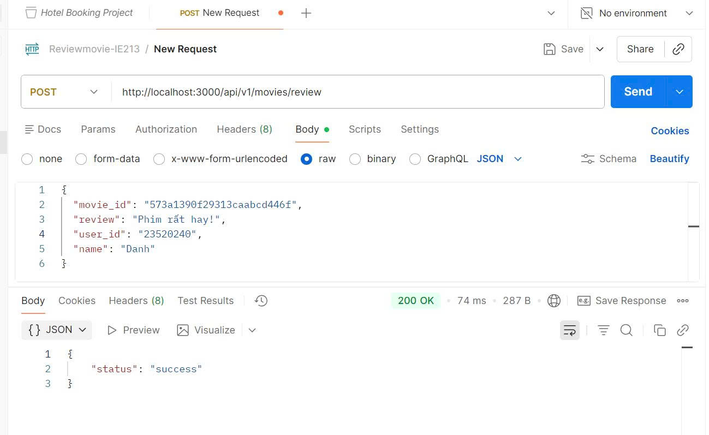
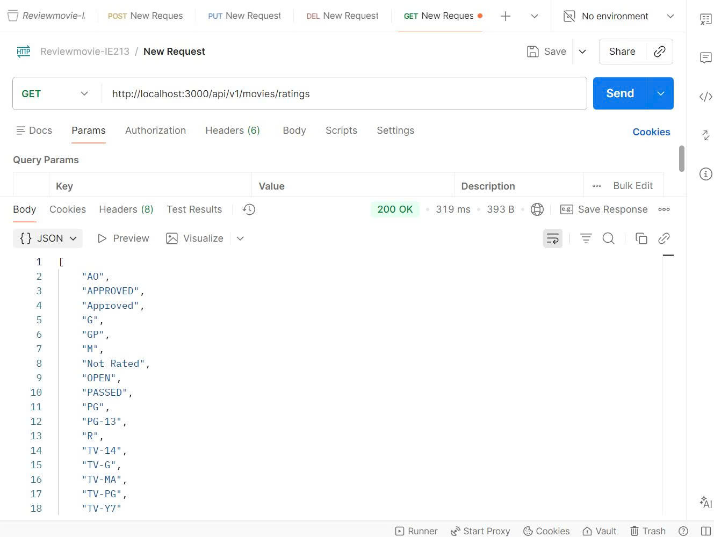
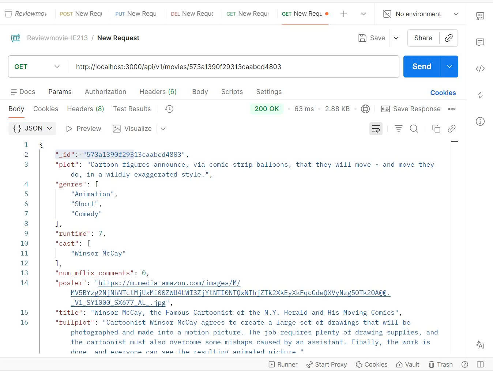
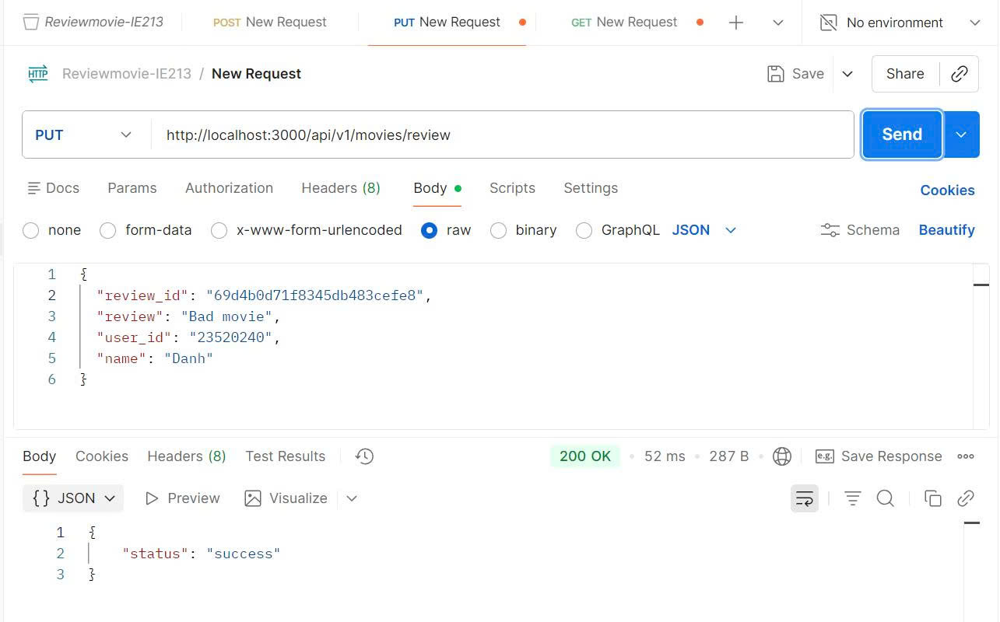
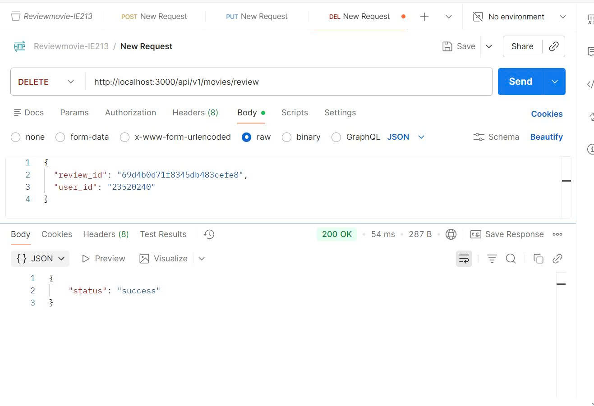

# Lab 03: Reviews API & Movie Details ✅

## 📌 Thông tin bài Lab

| Thông tin | Chi tiết |
|-----------|----------|
| **Tên Lab** | Reviews API & Movie Details |
| **Trạng thái** | ✅ Hoàn thành |
| **Nội dung chính** | Backend API cho Reviews và Chi tiết Phim |
| **Công nghệ** | Node.js, Express, MongoDB |

---

## 📚 Nội dung chính

### **Bài 1: Thiết lập Định tuyến cho Reviews** 
Tạo các route cho reviews trong `movies.route.js`:
```javascript
router.route('/review')
    .post(ReviewsController.apiPostReview)      // Thêm review
    .put(ReviewsController.apiUpdateReview)      // Cập nhật review
    .delete(ReviewsController.apiDeleteReview);  // Xóa review
```
- Endpoint: `POST/PUT/DELETE /api/v1/movies/review`

---

### **Bài 2: Tạo ReviewsController**
Implement 3 method chính trong `reviews.controller.js`:

#### 2.1 `apiPostReview()` - Thêm review mới
- Lấy dữ liệu từ request body: `movie_id`, `review`, `name`, `user_id`
- Tạo object `userInfo` chứa tên người dùng và user ID
- Ghi date hiện tại để tracking thời điểm tạo review
- Gọi `ReviewsDAO.addReview()` để lưu vào database

#### 2.2 `apiUpdateReview()` - Cập nhật review
- Lấy `review_id`, `user_id`, và nội dung review mới
- Ghi lại ngày cập nhật
- Gọi `ReviewsDAO.updateReview()` với điều kiện: phải là chủ sở hữu review
- Kiểm tra `modifiedCount` để xác nhận cập nhật thành công

#### 2.3 `apiDeleteReview()` - Xóa review
- Lấy `review_id` và `user_id` từ request body
- Gọi `ReviewsDAO.deleteReview()` để xóa, kiểm tra quyền sở hữu

---

### **Bài 3: Tạo ReviewsDAO**

#### 3.1 Kết nối Collection
```javascript
reviews = await conn.db(process.env.MOVIEREVIEWS_NS).collection('reviews');
```

#### 3.2 `addReview()` - Thêm review vào DB
- Tạo document: `{ name, user_id, date, review, movie_id (ObjectId) }`
- Sử dụng `insertOne()` để lưu review

#### 3.3 `updateReview()` - Cập nhật review
- Điều kiện: `{ user_id: userId, _id: ObjectId(reviewId) }`
- Cập nhật: `{ review, date }`
- Đảm bảo chỉ chủ sở hữu mới có thể sửa

#### 3.4 `deleteReview()` - Xóa review
- Điều kiện: `{ _id: ObjectId(reviewId), user_id: userId }`
- Sử dụng `deleteOne()` để xóa

---

### **Bài 4: Hoàn thành Backend cho Movie Application**

#### 4.1 Thêm 2 Endpoint mới

**`GET /api/v1/movies/:id`** - Lấy thông tin chi tiết phim
- Sử dụng aggregation pipeline
- Match phim theo `_id`
- Lookup joins reviews từ collection `reviews`
- Trả về phim với danh sách reviews

**`GET /api/v1/movies/ratings`** - Lấy tất cả ratings
- Sử dụng `distinct()` trên field `rated`
- Trả về array các rating duy nhất

#### 4.2 Implementation trong Movies Controller

```javascript
// Lấy phim theo ID
static async apiGetMovieById(req, res, next) {
    let id = req.params.id || {};
    let movie = await MoviesDAO.getMovieById(id);
    if (movie) {
        res.json(movie);
    } else {
        res.status(404).json({ error: "not found" });
    }
}

// Lấy danh sách ratings
static async apiGetRatings(req, res, next) {
    let ratings = await MoviesDAO.getRatings();
    res.json(ratings);
}
```

#### 4.3 Implementation trong Movies DAO

```javascript
// getMovieById - Aggregation Pipeline
static async getMovieById(id) {
    return await movies.aggregate([
        { $match: { _id: new ObjectId(id) } },
        {
            $lookup: {
                from: 'reviews',
                localField: '_id',
                foreignField: 'movie_id',
                as: 'reviews'
            }
        }
    ]).next();
}

// getRatings - Distinct values
static async getRatings() {
    return await movies.distinct("rated");
}
```

#### 4.4 Routes Configuration
```javascript
router.route('/').get(MoviesController.apiGetMovies);
router.route('/ratings').get(MoviesController.apiGetRatings);    // Lấy ratings
router.route('/:id').get(MoviesController.apiGetMovieById);      // Lấy phim theo ID
router.route('/review')
    .post(ReviewsController.apiPostReview)
    .put(ReviewsController.apiUpdateReview)
    .delete(ReviewsController.apiDeleteReview);
```

---

## 🔧 Cách chạy

### 1. Cài đặt dependencies (nếu chưa có)
```bash
cd Lab03/movie-reviews/backend
npm install
```

### 2. Setup file `.env`
```
MOVIEREVIEWS_DB_URI=mongodb://localhost:27017
MOVIEREVIEWS_NS=sample_mflix
PORT=3000
```

### 3. Khởi động server
```bash
nodemon index.js
```

Server sẽ chạy trên `http://localhost:3000`

---

## 📊 Kết quả thực hiện

### ✅ Các API Endpoint đã triển khai:

| Method | Endpoint | Chức năng |
|--------|----------|----------|
| GET | `/api/v1/movies` | Lấy danh sách phim (có lọc) |
| GET | `/api/v1/movies/ratings` | Lấy tất cả ratings |
| GET | `/api/v1/movies/:id` | Lấy chi tiết phim + reviews |
| POST | `/api/v1/movies/review` | Thêm review mới |
| PUT | `/api/v1/movies/review` | Cập nhật review |
| DELETE | `/api/v1/movies/review` | Xóa review |

### 📋 Cấu trúc File:

```
Lab03/
├── README.md (file này)
└── movie-reviews/
    └── backend/
        ├── index.js              (Entry point)
        ├── server.js             (Express setup)
        ├── package.json
        ├── .env                  (Configuration)
        ├── api/
        │   ├── movies.controller.js    (Controller cho movies)
        │   ├── movies.route.js         (Routes định tuyến)
        │   └── reviews.controller.js   (Controller cho reviews)
        └── dao/
            ├── moviesDAO.js      (Data Access Object - Movies)
            └── reviewsDAO.js     (Data Access Object - Reviews)
```

### 🔑 Key Concepts:

- **Controller**: Xử lý request/response logic
- **DAO (Data Access Object)**: Tương tác trực tiếp với MongoDB
- **Router**: Định tuyến các request tới controller tương ứng
- **Aggregation Pipeline**: `$match`, `$lookup` để join dữ liệu
- **ObjectId**: Chuyển đổi string sang MongoDB ObjectId
- **Async/Await**: Xử lý bất đồng bộ

---

## 🧪 Test API (Postman)

### **1️⃣ POST - Thêm review mới**

**Endpoint:**
```
POST http://localhost:3000/api/v1/movies/review
```

**Request Body:**
```json
{
  "movie_id": "573a1390f29313caabcd4803",
  "review": "Phim rất hay!",
  "name": "Danh",
  "user_id": "23520240"
}
```

**Response (Thành công):**
```json
{
  "status": "success",
  "review_id": "65f8a5c2b6e4d1f9c8a3b2e1"
}
```

**Kết quả test Postman:**



---

### **2️⃣ GET - Lấy danh sách ratings**

**Endpoint:**
```
GET http://localhost:3000/api/v1/movies/ratings
```

**Response (Thành công):**
```json
[
  "G", "PG", "PG-13", "R", "Not Rated", 
  "TV-14", "TV-G", "TV-MA", "TV-PG", 
  "TV-Y7", "AO", "APPROVED", "M", ...
]
```

**Kết quả test Postman:**



---

### **3️⃣ GET - Lấy thông tin chi tiết phim (kèm reviews)**

**Endpoint:**
```
GET http://localhost:3000/api/v1/movies/573a1390f29313caabcd4803
```

**Response (Thành công):**
```json
{
  "_id": "573a1390f29313caabcd4803",
  "title": "Winsor McCay, the Famous Cartoonist...",
  "year": 1911,
  "rated": "G",
  "plot": "...",
  "reviews": [
    {
      "_id": "65f8a5c2b6e4d1f9c8a3b2e1",
      "name": "Danh",
      "user_id": "23520240",
      "review": "Phim rất hay!",
      "date": "2024-04-07T10:30:00.000Z",
      "movie_id": "573a1390f29313caabcd4803"
    }
  ]
}
```

**Kết quả test Postman:**



**📌 Lưu ý:** 
- Lấy `_id` của review từ field `reviews[0]._id` để dùng cho PUT/DELETE
- Field `reviews` chứa tất cả reviews của phim

---

### **4️⃣ PUT - Cập nhật review**

**Endpoint:**
```
PUT http://localhost:3000/api/v1/movies/review
```

**Request Body:**
```json
{
  "review_id": "65f8a5c2b6e4d1f9c8a3b2e1",
  "review": "Phim này tuyệt vời lắm!",
  "user_id": "23520240"
}
```

**Response (Thành công):**
```json
{
  "status": "success"
}
```

**Kết quả test Postman:**



**⚠️ Lỗi thường gặp:**
```json
{
  "error": "Unable to update review. User may not be original poster"
}
```
**Giải pháp:** Kiểm tra `user_id` phải giống với lúc POST review

---

### **5️⃣ DELETE - Xóa review**

**Endpoint:**
```
DELETE http://localhost:3000/api/v1/movies/review
```

**Request Body:**
```json
{
  "review_id": "65f8a5c2b6e4d1f9c8a3b2e1",
  "user_id": "23520240"
}
```

**Response (Thành công):**
```json
{
  "status": "success"
}
```

**Kết quả test Postman:**



---

### 📋 Tóm tắt Test Workflow

| Bước | Method | Endpoint | Mục đích |
|------|--------|----------|----------|
| 1 | POST | `/api/v1/movies/review` | Thêm review → lấy `review_id` |
| 2 | GET | `/api/v1/movies/ratings` | Lấy danh sách ratings |
| 3 | GET | `/api/v1/movies/:id` | Lấy phim + reviews (xác nhận review được lưu) |
| 4 | PUT | `/api/v1/movies/review` | Cập nhật review (dùng `review_id` từ bước 1) |
| 5 | DELETE | `/api/v1/movies/review` | Xóa review |

---

## ✨ Hoàn thành

Bài Lab 03 đã hoàn thành tất cả yêu cầu:
- ✅ Thiết lập Reviews API
- ✅ Implement CRUD operations cho reviews
- ✅ Lấy chi tiết phim kèm reviews
- ✅ Lấy danh sách ratings
- ✅ Proper error handling
- ✅ Structured code architecture (MVC pattern)
- ✅ Test API thành công với Postman
